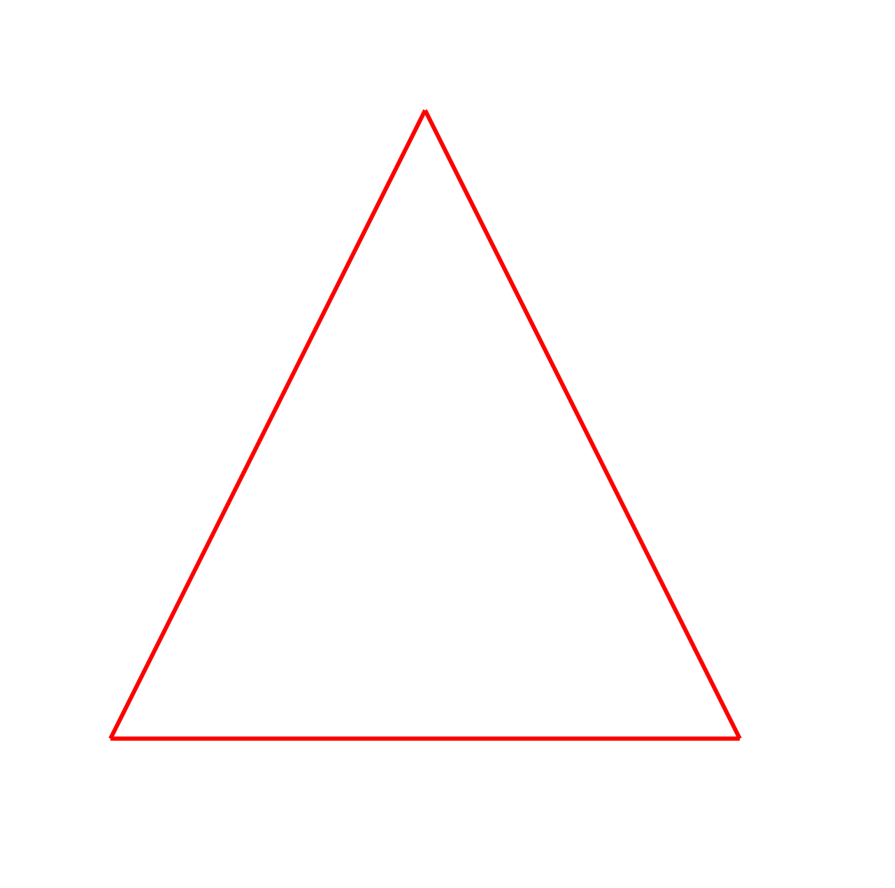
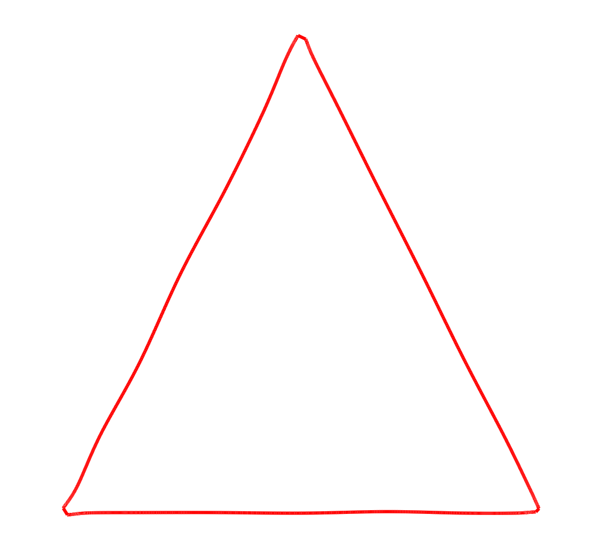

# Artistic-Drawing
The aim of this project is to generate artistic human-like drawn lines/curves.

While there is no precise metric yet discovered to differentiate between hand-drawn and computer-generated line drawings, humans can typically distinguish with ease the difference by a shear glance. The goal of this project is to produce lines that resemble human-drawn lines and may be used to replace traditional computer drawn lines.

Human drawn lines/curves seem more familiar and easy to understand than what computer drawn sharp and crisp line do. An example to illustrate the above is given below -

Normal Lines| Line generated by application developed in this project
------------ | -------------
 | 

## Application Usage
The output/results of the application can be produced using OpenGl or SVG.
#### SVG (Requirements : Google Chrome Web Browser and g++)

    ● Go to the "SVG" Folder.

    ● On terminal type the command : $ make

    ● If the command is successful, it will produce an executable named "ArtisticLines".

    ● Create a file in the same folder for giving the input points to the program or you can use the existing "points.txt" file.

    ● For running the executable, type this command in terminal : $ make run

    ● Now follow the instructions on the command file.

    ● After the program has finished, it will produce a file "outputSVG.svg" which can be viewed in the Chrome Browser.

#### OpenGl (Requirements : OpenGl 3.3 or higher)

    ● Go to the "OpenGl" Folder.

    ● On terminal type the command : $ make

    ● If the command is successful, it will produce an executable named "ArtisticLines".

    ● If the command fails, use the SVG method.

    ● Create a file in the same folder for giving the input points to the program or you can use the existing "points.txt" file.

    ● For running the executable, type this command in terminal : $ make run

    ● Now follow the instructions on the command file.

#### Parameters
The application asks for the following parameters as input when the executable is run -

    ● Points Filename : Name of file that contains the input points to be given to the program.

    ● Final Time(tf) [<int> ideally 2] : Time value for the final hand position while drawing a line between a pair of points.

    ● dt (Δt) [<float> ideally 0.2] : Value for the time step Δt.

    ● Randomness (D) [<int> ideally 5] : Value for the deviation parameter squiggle.

    ● Spline Curve Parameter [<int> ideally 50] : The number of points to be plotted between pair of control vertices while
      constructing the Catmull-Rom Splines.

    ● Line Width [<int> ideally 3] : Line Width that is used to draw in SVG.

## Results
Parameters| Output
------------ | -------------
**Final Time : 2   Time increment : 0.1   Randomness : 5   Linewidth : 3   Spline Curve Parameter : 50** | 
**Final Time : 2   Time increment : 0.1   Randomness : 5   Linewidth : 3   Spline Curve Parameter : 50** | 
**Final Time : 2   Time increment : 0.1   Randomness : 5   Linewidth : 3   Spline Curve Parameter : 50** | 
**Final Time : 2   Time increment : 0.1   Randomness : 5   Linewidth : 3   Spline Curve Parameter : 50** | 
**Final Time : 2   Time increment : 0.1   Randomness : 5   Linewidth : 3   Spline Curve Parameter : 50** | 
